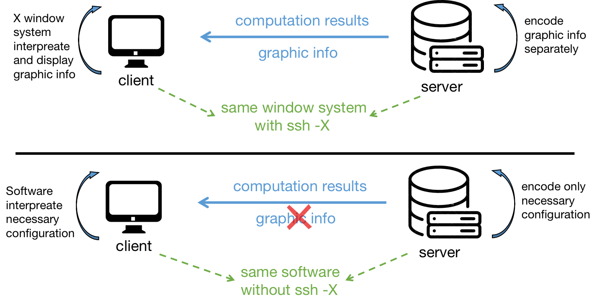

# Remote Access

This page introduces the lab network configurations and the access methods to remotely operate the lab computer. 


## Network Configuration

All servers are connected to the NYU network with the IP address in [Basic Lab Info: Network Configuration](_pages/basic_lab_info.md#network-configuration). 

Note that NYU network is an encriptied and private network. So the IP addresses above are all private addresses. We need to connect the NYU private network via *cisco anyconnect*, then we are able to access the server. 

**Note:** *cisco anyconnect* software is available for Windows and MacOS. For Linux system, *openconnect SSL* is recommended as a substitute of *cisco anyconnect*. The installation and operation steps are as follows.

```bash
# step 1: install OpenConnect
sudo apt update
sudo apt install openconnect
# step 2: connect to NYU vpn
openconnect vpn.nyu.edu
# step 3: choose NYU VPN: All Traffic. Then follow the instruction
```


## Remote Access via SSH 

SSH or Secure Shell is a network protocol which offers clients remote operations to the sever such as login, remote command-line, etc. We may use `ssh` command to access the Linux server directly. `ssh` command usually provides a command line interface to the computer, which means that we may only use command line to interact with the server.For most applications such as MATLAB, graphic interfaces are important. However, the graphic support of `ssh` command is limited for Windows and MacOS. The graphic support does not mean that the server provides a graphic desktop for a client. It means whether a client can open the graphic interface for a specific application. 

The following lists how to use `ssh` in Linux and MacOS, and how to enable `ssh` with graphic support in MacOS.


### SSH in Linux

For computer with Linux system, SSH can provides both graphic and non-graphic support to access the Linux server remotely. The ssh format of `ssh` goes as follows.

```bash
ssh [option] username@ip_address
```

 For example, we want to remotely access the Linux server with username `abc`. We know the server has the IP address `1.1.1.1`, then we type

```bash
ssh abc@1.1.1.1 	# for non-graphic application use
ssh -X abc@1.1.1.1 	# for graphic application use
```

After the login, we can use command line to start a application. 

`ssh -X` means enableing `X11` forwarding. `X11` is a window system for bitmap displays, and it provides a framework for a GUI environment. Take MATLAB for example. we cannot visualize MATLAB graphic interface if we do not include `-X` option. However, the graphic interface is available if we include `-X`.


### SSH in MacOS

SSH for non-graphic application use is the same as above. For graphic application use, since it is related to the display protocal, we need to install additional app [*XQuartz*](https://www.xquartz.org/). MacOS native applications do not use the X protocol for the rendering, but the Mac specific protocol. So we cannot use ssh X protocol forwarding as we could with a Linux server. So we need to install a X server on MacOS and have the Linux program appear on Mac.

The following websites and video gives a good tutorial for *XQuartz* installation:

- [Instructions to Connect to a Remote Linux Server and Open a Graphical Program](https://princetonuniversity.github.io/PUbootcamp/ssh-instructions/)
- [Installing or Reinstalling XQuartz](https://www.l3harrisgeospatial.com/Support/Self-Help-Tools/Help-Articles/Help-Articles-Detail/ArtMID/10220/ArticleID/23855/Installing-or-Reinstalling-XQuartz-if-Upgrade-to-macOS-1015-Catalina-Causes-Issues)
- [Connect to Graphical Applications on Linux using XQuartz on a Mac](https://www.youtube.com/watch?v=s6e3cqCISaE)


### Graphic Interface in Modern Software

When using `ssh -X`, the server reder the display information and send back to the client. The client will interprete the display information and display to the user. This process is generic and can be applied to any software with graphic interface. However, the access process can be slow because of huge amount of display information. 

In practice, many softwares do not need to enable `-X` option to have graphic interface. They only require the server and software to have the same software. The server runs the software and send the computation back only. The client software receive the computation results and display the result to the user directly. No additional display information needs to be transmitted. The following figure shows two different modes. 



Many software such as *VS code* and *PyCharm* all follow the same pattern. We will discuss SSH of these softwares in [xxxxxxxxxxxxxxxxxx]()


### Interpretation of `-X` Parameter

(add more).


## Remote Access via VNC

Virtual Network Computing (VNC) is a graphical desktop-sharing system that uses the Remote Frame Buffer protocol (RFB) to remotely control another computer. 

(more to add...)


